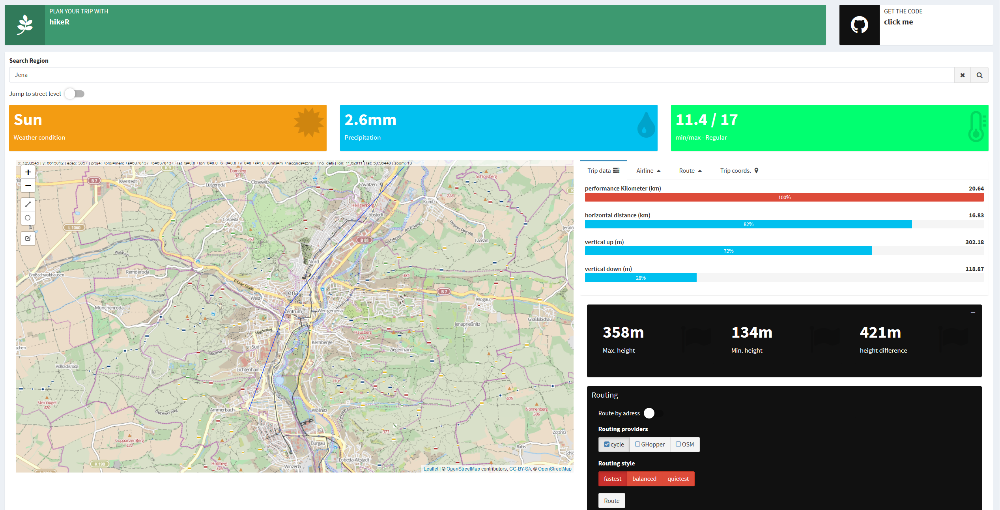
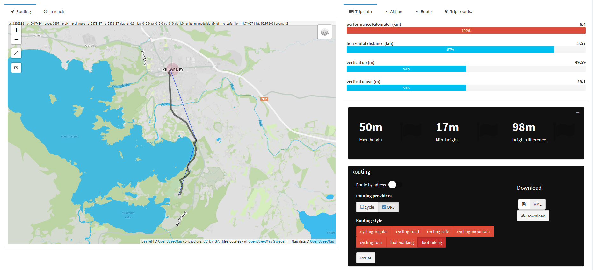
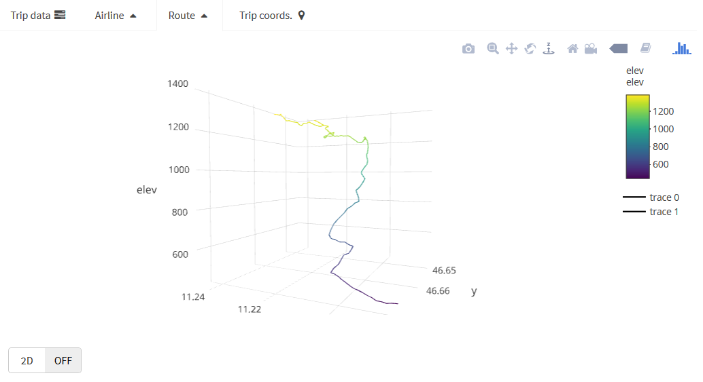
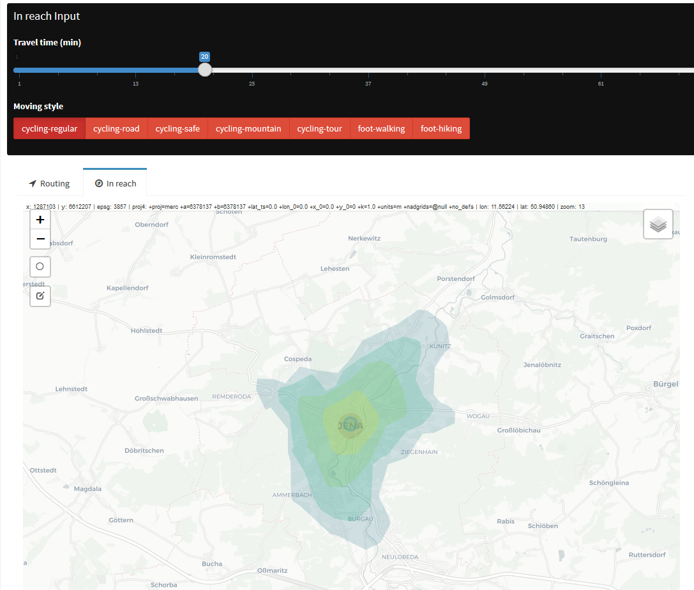

# hikeR :tent:
A shiny application in order to ease up planning for the next hiking or bike trip.

# ~~server version currently not working~~ Working again, enjoy! http://mccoy.geogr.uni-jena.de:3838/eric/hikeR/

## *graph hopper* routing is not working at the moment, because i dont have a working api key
## to deploy the application, download repo and start it locally - for graphhopper and cyclestreets.net routing a api key is required

## Main features:

### Routing:
- route by drawing the airline distance on the map (multiple points possible)
- route by adress (multiple adresses possible)
- multiple routing providers with diffrents routing styles for cycling and hiking

### Elevation
- draw a 2d or 3d elevation profile
- calc. vertical distance and performance kilometers

### In reach
- pin a point an the map an get reachability output based on travel time and moving style

