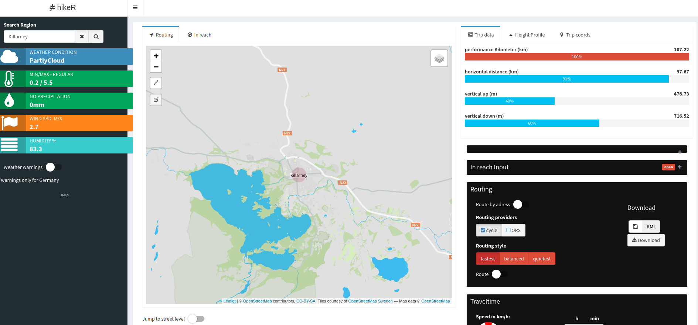

# hikeR :tent:
A shiny application in order to ease up planning for the next hiking or bike trip.

```r
install.packages("devtools")
devtools::install_github("EricKrg/hikeR")
```
## run the app locally:
if you want to run the app locally you will need three api keys:
- [elevation](https://developers.google.com/maps/documentation/elevation/#api_key)
- [cyclestreets.net](https://www.cyclestreets.net/)
- [open-route service](https://openrouteservice.org/)

```r
hikeR::hike_app(elevation_api,cycle_api,ors_api)
```


## The App


## Main features:

### Routing:
- route by drawing the airline distance on the map (multiple points possible)
- route by adress (multiple adresses possible)
- multiple routing providers with diffrents routing styles for cycling and hiking


### Elevation
- draw a 2d or 3d elevation profile
- calc. vertical distance and performance kilometers


### In reach
- pin a point on the map an get reachability output based on travel time and moving style


